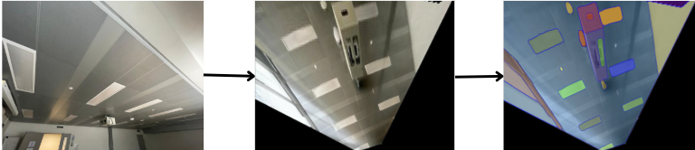
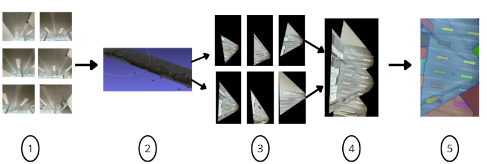

This project, carried out in collaboration with Saint-Gobain, is part of a circular economy initiative aimed at promoting the reuse of construction materials rather than their disposal, in order to reduce the environmental footprint of renovation work. The main objective was to develop an automated method to identify, locate, and assess the condition of elements installed on ceilings and partitions in commercial environments such as office spaces.

Ceilings often contain a variety of technical components, including light fixtures, smoke detectors, air diffusers, sprinklers, access panels, and more. The challenge lies in automatically detecting which of these components are still reusable, in good condition, and compatible with a new layout, while excluding those that are damaged, obsolete, or unsuitable. Particular attention was paid to ensuring that the developed tools could not only detect these elements but also count them automatically to facilitate on-site inventory.

To address these challenges, the project leveraged digital tools based on images captured on site to reliably assess the condition of ceiling components. This technological approach supports more sustainable renovation practices by enabling the identification, counting, and reuse of existing elements in a controlled and efficient manner.

**Main Objective :**

The study began with a technical observation: it is difficult to capture an entire ceiling in a single image suitable for automated detection of its various components. Standard cameras have a limited field of view, requiring multiple shots from different angles to cover the full surface. While 360° cameras provide a wider field of view, they introduce geometric distortions and pixel stretching, making the resulting images poorly suited for detection tasks.

This project aims to design a pipeline capable of automatically generating a rectified, orthonormal view of the ceiling from images taken at different angles, in order to enable automatic segmentation of its components. The pipeline is structured around two main components:

  - Perspective Image Rectification
This step involves correcting perspective distortions and stitching the resulting images to generate a unified rectified ceiling view. The proposed method relies on a 3D reconstruction approach, which aligns multiple images within a common reference frame, models the ceiling plane, and projects the partial views onto it. A homography matrix encoding the geometric relationship between the source images and the target image is then computed to produce a final, coherent, and exploitable rectified view.

  - Segmentation of the Rectified View
Once the rectified view is generated, automatic segmentation is applied to detect the different components embedded in the ceiling. This stage demonstrates the feasibility of detecting elements on a flattened, planar surface such as ceiling tiles, light fixtures, smoke detectors, and other architectural components even when repetitive patterns are present. The goal is to validate that the geometric transformation applied earlier enables reliable and accurate segmentation.

This project thus proposes a complete solution that combines 3D reconstruction, image rectification, and segmentation techniques to support automated ceiling analysis from multi-perspective images.

**Relevance and Potential Applications :**

This project aims to enable a reliable assessment of material condition based on in-situ images, prior to renovation operations. This approach has a dual purpose: it promotes the reuse of still-usable materials as part of a resource-conscious strategy, and it simplifies the work of professionals by facilitating early-stage identification and planning. The ceiling was chosen as a case study due to its many constraints: it is elevated, difficult to access, cluttered with various technical components (lighting, sensors, ventilation), and often photographed from challenging angles. These difficulties make it an ideal testing ground for an automated recognition and inventory method.

Despite these challenges, the results are promising: they show that images taken in real conditions allow for a reliable estimate of what can be preserved. This opens up concrete opportunities, particularly for better planning of dismantling operations, reducing waste, and anticipating supply needs.

Moreover, the approach can be applied to other visible building components, such as walls or integrated furnishings. It could thus be used in a variety of renovation, layout, or maintenance scenarios. In the longer term, the method could be integrated into broader building management processes: site monitoring, quality control, or structured condition assessments for operational planning.
